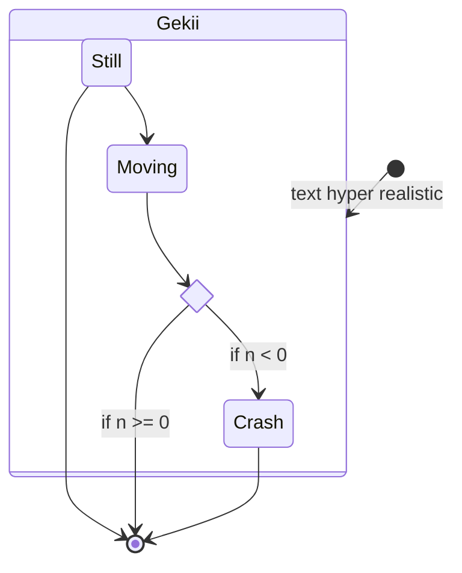
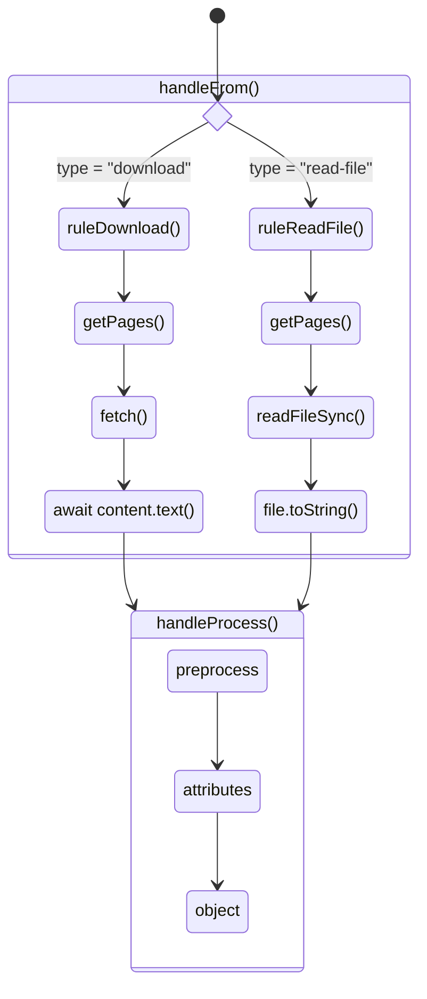

# chymy

> Typescript web scraping utils

All the methods are typed, documented and tested

## documentation

### `handleFrom`

Allows to get data from a source:

- fetch
- read file

### `handleProcess`

Allows to parse data with a config in this order:

1. all string, xml and html rules in order
2. the object rules

## TODO

- [ ] create folder if it does not exist
- [ ] change writeFileSync file extension based on file type (add .xml)
- [ ] verify that:
  - [ ] a rule has only one preprocess step
  - [ ] each step has the correct input

